# Haras de la Baie

Jeu Android d'élevage et d'équitation **réaliste** : vous dirigez un haras sur la côte normande. Vous soignez, nourrissez, pansez, montez, entraînez, faites saillir et vendez vos chevaux, et vous les menez du concours Club au Grand Prix.

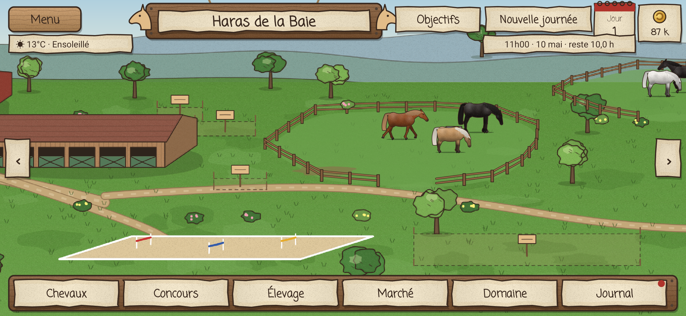

## Comme Horses of Hoofprint Bay… en plus poussé

- **Style illustré** : carte du domaine en vue de trois quarts, encre et aquarelle, interface en planches de bois et parchemins.
- **Journée de travail** de 7 h à 21 h : chaque action prend du temps, puis « Nouvelle journée » et le rapport de la nuit.
- **Domaine à l'abandon** au départ : caravane, vieil abri de 2 boxes, déchets à débarrasser, bâtiments à restaurer sur la carte.
- **Apprentissage** depuis le menu : parcours complet (18 étapes guidées) ou rapide (6 étapes), sur un domaine d'entraînement séparé de votre sauvegarde.
- **Objectifs** récompensés (23 étapes, du premier pansage au Grand Prix), **cours d'équitation** à donner, stats de **Force** et **Confiance**.
- **Chevaux vivants au paddock** : promenade, demi-tours, troupeau qui reste groupé, poulains qui suivent leur mère, sieste couchée la nuit.
- **Objectifs guidés** : touchez un objectif, la carte défile jusqu'au lieu et une flèche montre où aller.
- **Haute école** : piaffer et passage en séance, au Grand Prix de dressage et en cours de dressage avancé donné en selle devant les élèves.
- **10 modes de monte** : balade, dressage (figures et cadence), CSO, hunter, cross, course de galop, trot attelé au sulky, endurance, barrel race western, travail sur le plat.

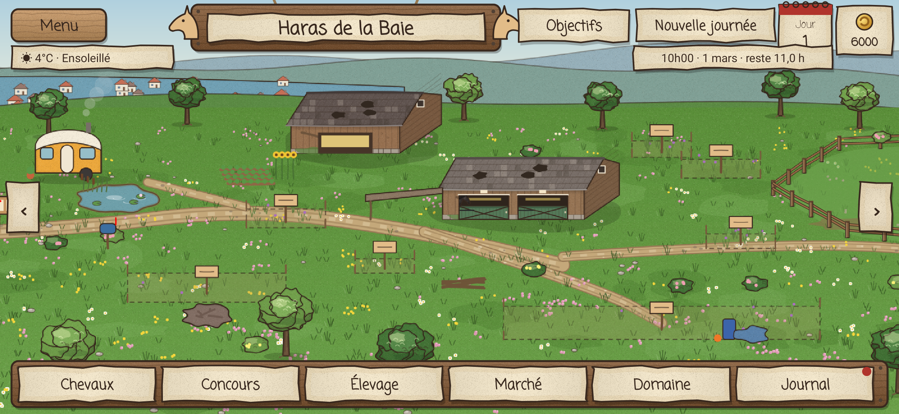
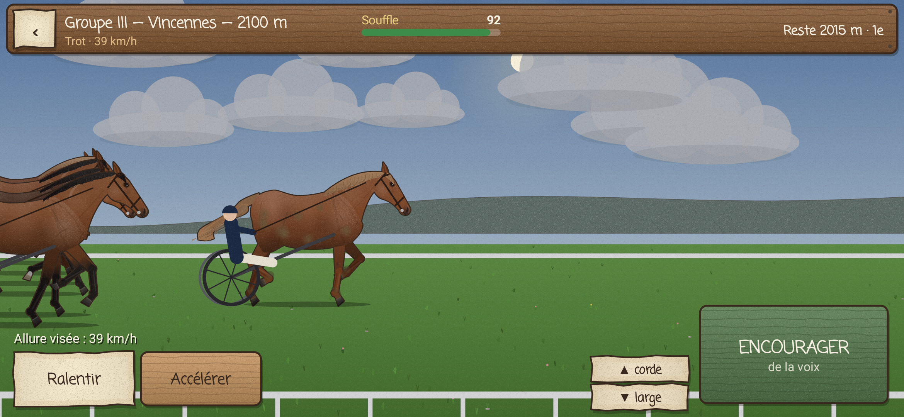
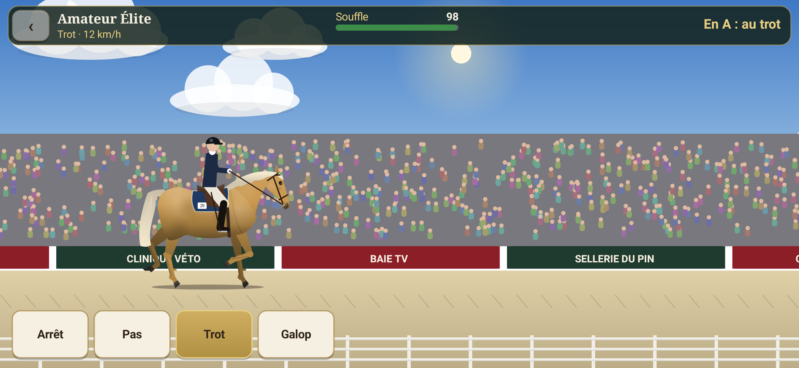

## Le cheval, au cœur du réalisme

**Rendu anatomique, sans aucune image.** Chaque cheval est dessiné par le code sur un squelette : tronc, encolure et tête articulés, et membres en cinématique inverse (coude-genou-boulet devant, cuisse-jarret-boulet derrière). Le rendu suit :

- **Les allures réelles**, avec leur schéma de foulée : pas à 4 temps latéral, trot diagonal, galop à 3 temps avec temps de suspension, grand galop à 4 temps. Le saut se fait en 5 phases (battue, planer, réception). Les membres se plient vraiment (genou et jarret repliés au soutien, bascule du pied avant le départ), le cheval se rassemble ou s'allonge, et les crins rebondissent à chaque battue.
- **Le piaffer et le passage** : trot sur place, avant-bras à l'horizontale et hanches abaissées ; trot suspendu au ralenti.
- **La morphologie de la race** : tête concave de l'arabe, busquée du lusitanien, fanons du frison, masse du percheron, port de queue.
- **L'état du cheval** : côtes visibles s'il est maigre, ventre rond s'il est gros, musculature, brillance du poil, boue s'il est sale, couverture l'hiver. Les poulains ont des membres longs, une tête plus grosse et une encolure courte.

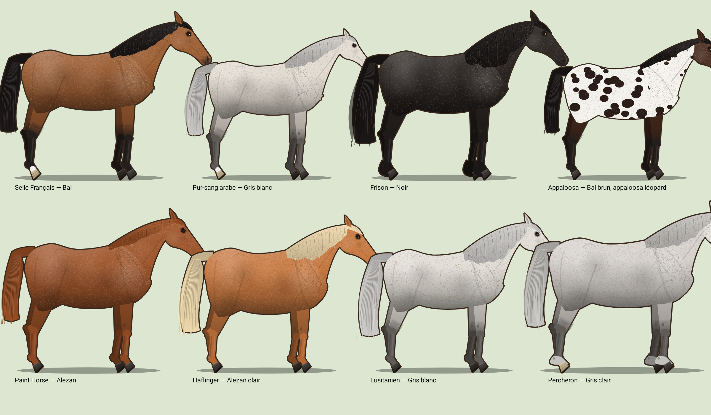
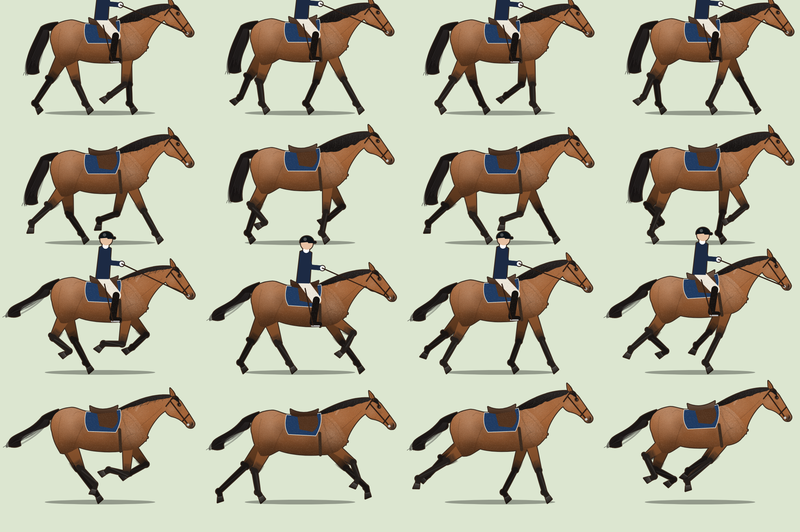
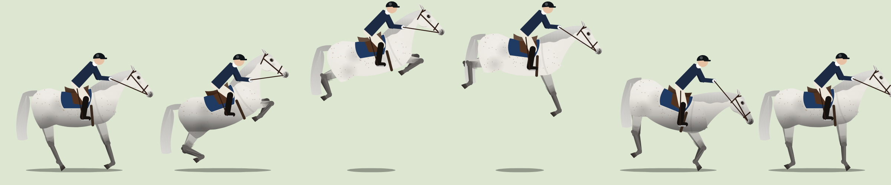

**Génétique réelle des robes.** 13 locus mendéliens sont simulés : E, A, Crème, Dun, Gris, Silver, Champagne, Tobiano, Frame overo, Sabino 1, Léopard, Pattern 1 et Rouan. Le jeu en tire alezan, bai, noir, palomino, isabelle, crème, souris, louvet, aubère, rouan bleu, pie tobiano, overo, appaloosa léopard ou à couverture, etc. Les gris naissent foncés puis blanchissent avec l'âge, en passant par le pommelé. Le gène létal est simulé : deux porteurs Frame overo donnent 25 % de poulains O/O non viables. Le test ADN révèle les gènes cachés.

**Caractères héritables.** 12 aptitudes (vitesse, endurance, saut, respect des barres, allures, calme, courage…) ont chacune leur héritabilité. Le produit hérite de la moyenne de ses parents plus un aléa mendélien. La consanguinité est calculée selon Wright et provoque une dépression sur les caractères de vigueur. Le gène de la myostatine (C/C sprinteur, T/T stayer) joue en course et en endurance.

**16 races.** Selle Français, Pur-sang, Pur-sang arabe, KWPN, Hanovrien, Lusitanien, Frison, Quarter Horse, Paint Horse, Appaloosa, Connemara, Haflinger, Percheron, Trotteur Français, Islandais, et origine non constatée. Les règles d'admission des stud-books sont respectées (un SF peut naître d'un Pur-sang, par exemple). Les noms suivent la lettre de l'année SIRE (2027 = T).

## S'occuper de ses chevaux

- **Besoins simulés heure par heure** : fourrage au râtelier (le cheval mange en continu), seau d'eau, litière, propreté, moral, énergie, sabots, dents, complicité.
- **Nutrition** : la ration de foin et de granulés est réglable. Une note d'état corporel Henneke (1 à 9) et le poids évoluent selon le bilan énergétique (entretien, travail, croissance, gestation, lactation, froid). Un poulain sous-alimenté grandira moins.
- **15 affections**, chacune avec ses causes réalistes : colique (gros repas de céréales, jeûne, déshydratation), fourbure, boiterie, tendinite, abcès, gale de boue, grippe et gourme (contagieuses, la grippe évitée par le vaccin), tétanos après une plaie, ulcères, parasitisme, coup de chaleur, arthrose et mélanome chez les gris âgés.
- **Soins** : vétérinaire, maréchal (parage ou ferrure), dentiste, vaccins, vermifuge, couverture, tonte.
- **Pansage au doigt, au plus près du vrai** :
  - La saleté est peinte sur la robe : boue des roulades et des membres, poussière, sueur séchée sous la selle, taches de litière. Elle part exactement là où passe l'outil.
  - L'étrille travaille en petits cercles, se remplit de poils (surtout pendant la mue) et se tape pour la vider. Elle fait mal sur la tête et les canons.
  - La brosse dure s'utilise dans le sens du poil. La brosse douce fait briller et c'est la seule pour la tête.
  - Le peigne démêle les crins en commençant par le bas.
  - Le cure-pied se passe pied levé, en gros plan, du talon vers la pince : il révèle les cailloux, la pourriture de fourchette et le fer qui bouge.
  - Le cheval réagit : il remue la lèvre quand on lui gratte le garrot, couche les oreilles ou tape du pied quand il est brusqué.
  - L'inspection révèle les plaies, la gale de boue, les tiques et les membres chauds.

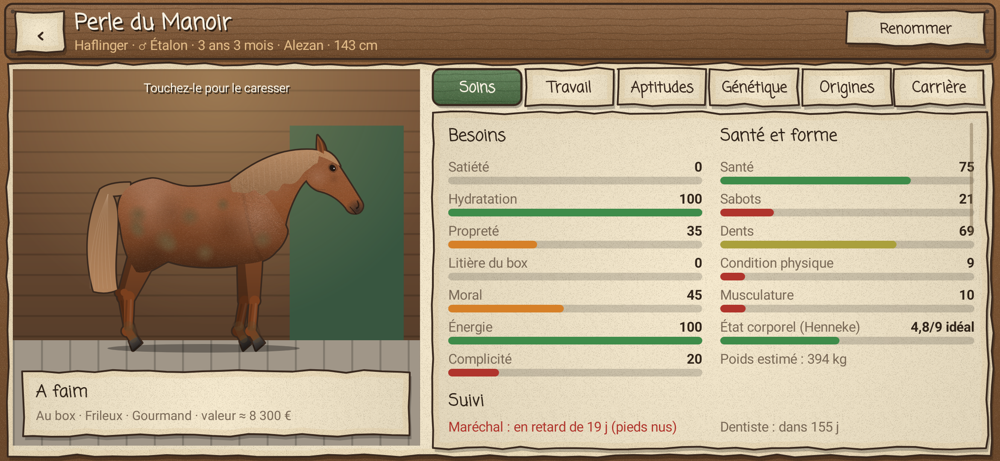
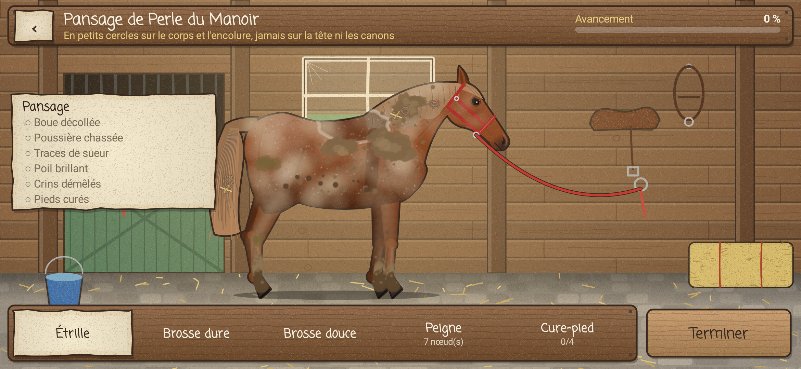

## Monter

- **Balade libre** à travers bocage, forêt et plage de la baie, avec mouettes et écarts de peur pour les chevaux peureux.
- **Parcours d'obstacles** : on appuie sur SAUTER au point de battue. Barres, refus, élimination au 2e refus, temps accordé.
- **Cross** : troncs, haies, stères et gué, avec un temps idéal à respecter.
- **Reprise de dressage** : on change d'allure à la lettre demandée (A K E H C M B F), et chaque figure est notée sur 10.
- **Course de plat** contre 6 pur-sang : on gère son souffle et on pousse dans la dernière ligne droite.

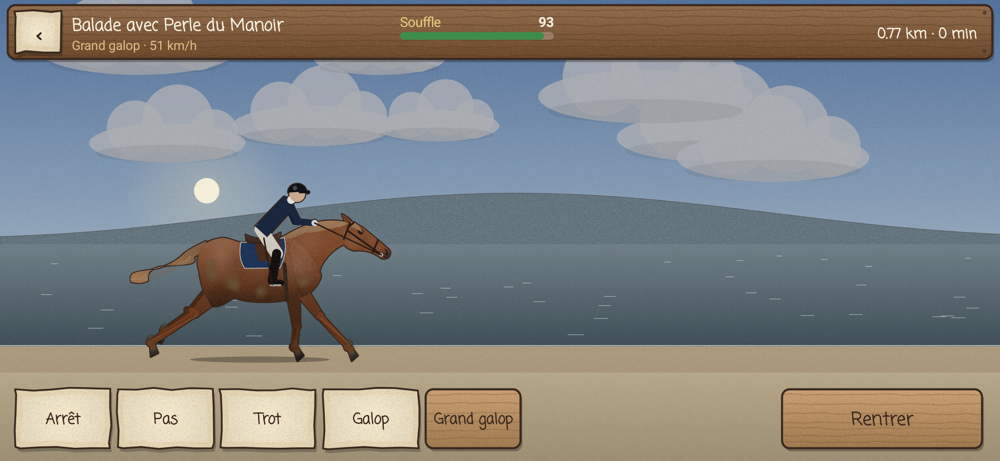
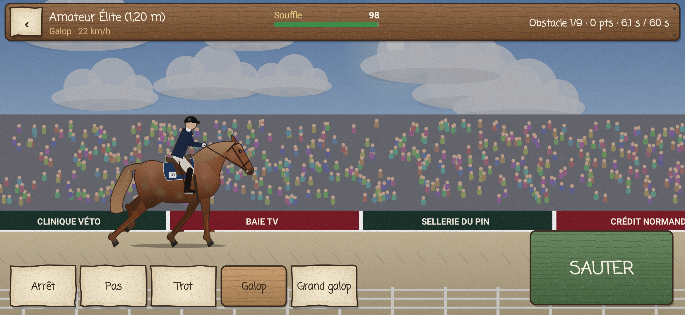
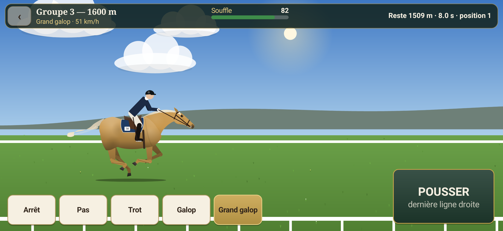

## Le domaine et sa vie

- **Temps réel** : jour et nuit, levers et couchers du soleil selon la saison, et météo océanique (pluie, orage, neige, brouillard, tempête, canicule). L'état du sol (dur, souple, lourd, gelé) influe sur les blessures et les performances, et la pousse de l'herbe suit les saisons.
- **15 bâtiments** : écurie, prairies, carrière, manège, marcheur, piste, cross, grange, abreuvoirs, box de poulinage, infirmerie, douche, sellerie, club-house et camion.
- **Une équipe** : palefreniers, soigneurs (qui appellent le vétérinaire en urgence et ajustent les rations), cavaliers (qui suivent le programme de travail de chaque cheval), moniteurs et lads.
- **Une économie** : stocks dont le prix varie avec les saisons, salaires, entretien, cours d'équitation, pensions, sponsors selon la réputation, agios à découvert. Un domaine où les chevaux sont négligés peut aussi être contrôlé par les services vétérinaires.
- **Les concours** : 7 disciplines (CSO, dressage, complet, course, endurance, attelage, modèle et allures) sur 6 niveaux, du Club 2 au CSI 5*, du réclamer au Groupe 1. Le calendrier est tenu par des lieux réels (Deauville, Saumur, Pau, Chantilly…). Il faut des vaccins à jour, et les Galops fédéraux du cavalier se passent en examen.
- **L'élevage** : cycles des juments, saison de monte, suivi gynécologique, échographie, gestation d'environ 340 jours, poulinages de nuit avec risque de dystocie, sevrage, débourrage vers 3 ans. Un pronostic de robe est calculé par simulation, avec le coefficient de consanguinité.
- **Le marché** : annonces avec ascendance sur deux générations et visite d'achat. On peut mettre ses chevaux en vente et recevoir des offres, ou vendre au marchand. Ses étalons peuvent être proposés à la saillie.

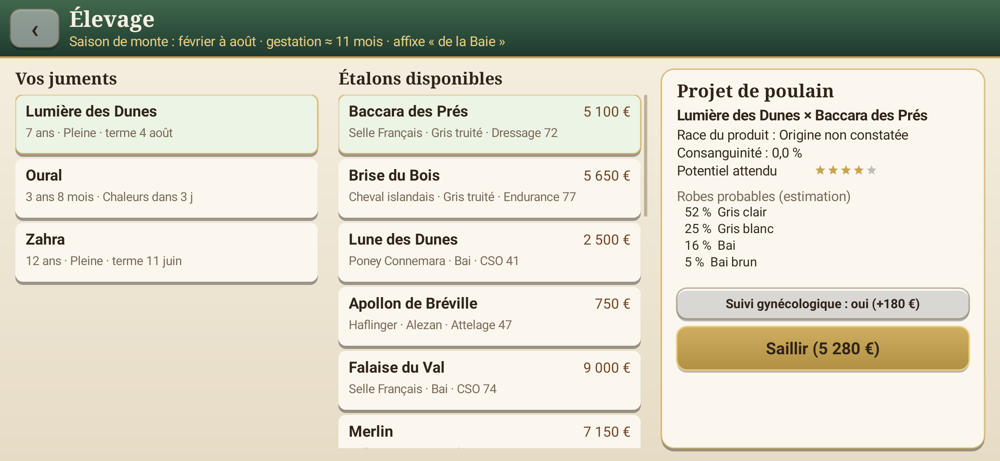
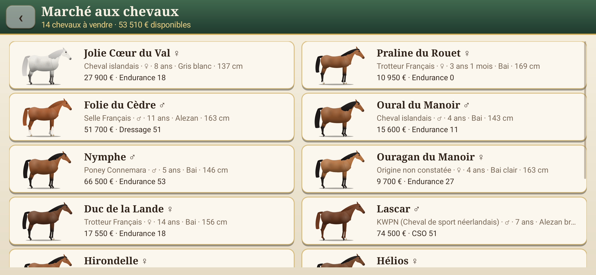

Tous les sons sont synthétisés : sabots sur l'herbe ou sur sol dur, hennissement, ébrouement, brosse, mastication, applaudissements, cloche du jury, barre qui tombe. La partie est sauvegardée automatiquement chaque jour de jeu.

## Architecture

- `core/` : moteur pur Kotlin/JVM, sans Android (génétique, races, cheval, santé, travail, concours, économie, sauvegarde JSON). Il est testé : ratios mendéliens, gène létal, consanguinité (plein frère × pleine sœur = 25 %), naming des robes, héritabilité, poulinage, concours, sauvegarde et rechargement identiques, et 2 ans de domaine simulés.
- `app/` : application Android légère, avec une seule `View` accélérée matériellement, une interface en mode immédiat et un rendu vectoriel. Aucune image, aucun son, aucune bibliothèque tierce.

## Compiler

```bash
./gradlew :core:test                # tests du moteur
./gradlew :app:assembleDebug        # APK dans app/build/outputs/apk/debug/
./gradlew :core:debugSim --args="1 2"   # journal d'un domaine simulé pendant 2 ans
```

La CI GitHub Actions lance les tests et publie l'APK en artefact. `tools/local-check/` permet une vérification hors Android Gradle Plugin : compilation contre `android.jar`, APK assemblé avec les outils Debian (`build-apk.sh`), captures d'écran Robolectric et génération de l'icône.
